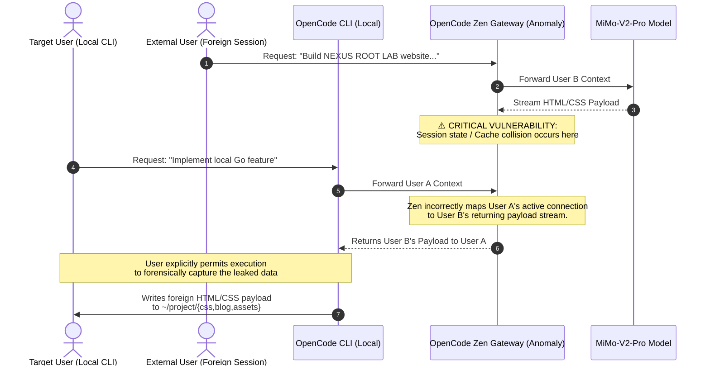

# Incident Report: OpenCode Zen Cross-Session Data Leakage

## About This Repository

On April 2, 2026, a cross-session data leak via the OpenCode Zen provider caused another user's session payload to be streamed into my local agent session and executed. The leaked payload contained a project named "NEXUS ROOT LAB". I registered this GitHub namespace immediately — the routing failure that caused this may have exposed that session to multiple unknown recipients, and I wanted to ensure the affected party had a way to find out what happened and who saw it.

This repository is the formal public disclosure of the vulnerability and a contact point for anyone affected.

> **To the owner of the NEXUS ROOT LAB project:** Your session data — including your project structure, design specifications, and prompt instructions — was leaked to at least one other user's machine without your knowledge. You are a victim of this incident. I registered this namespace in good faith so you could find it. If you want to know what was captured, coordinate on this disclosure, or simply make contact, please [open an issue](https://github.com/nexusrootlab/incident/issues) on this repository.

No responsible disclosure channel was identified for Anomaly Innovations Inc. / OpenCode Zen. This repository also serves as the formal public disclosure of the underlying vulnerability.

---

## 1. Executive Summary

On April 2, 2026, a critical security and privacy vulnerability was observed while utilizing the `mimo-v2-pro-free` model via the **OpenCode Zen** provider (maintained by [Anomaly Innovations Inc.](https://anoma.ly)). During a routine local development task, the OpenCode agent suffered a severe context collapse, overriding the user's local prompt with instructions and code payloads originating from a completely different tenant's session.

To forensically capture and verify this anomaly, the user explicitly permitted the agent to write the foreign payload to a local directory. This incident demonstrates a severe **Tenant Isolation Failure (Cross-Session Data Leakage)** at the API gateway layer, resulting in the plaintext exposure of the LLM's response to another user's session — revealing their project structure, design specifications, and prompt intent.

The output the LLM generated from the leaked payload is preserved as a forensic artifact at: **https://github.com/nexusrootlab/website**

---

## 2. Environment & Metadata

| Field | Value |
|---|---|
| **Date of Incident** | April 2, 2026 |
| **Provider Component** | OpenCode Zen (API Gateway / Multiplexer) |
| **Model** | MiMo V2 Pro Free (`mimo-v2-pro-free`) |
| **Session ID** | [REDACTED — present in full in `session.log`] |
| **Client Tool** | OpenCode CLI (running locally via tmux) |
| **Initial Local Target** | [REDACTED_WORKSPACE_PATH] |

---

## 3. Chronology of the Anomaly

### Phase 1: Expected Execution

The user initiated a session to generate Go code for a local CLI project. The agent correctly ingested local files and successfully generated and saved the target file.

### Phase 2: Tenant Isolation Breach (Data Leak)

Immediately after the successful file write, the agent's internal thought process completely fractured. It began processing a web development task intended for another user on the platform.

**Forensic Evidence (Leaked Payload):** The agent began generating a complete website for a project named **"NEXUS ROOT LAB"**. The leaked payload was not limited to HTML and CSS — it contained a full constructed identity profile for the foreign user, including:

- Specific design specs from their prompt: *"Dark hacker terminal palette (#050507 base, #00ff88 accent)"*, *"Rajdhani for headings"*, *"SVG-only icons"*
- A fabricated professional biography: job titles, employer names (Vertex Security Labs, Cipher Prime Inc., Apex Defense Group), years of employment, and role descriptions
- Claimed statistics: 47 CVEs filed, 12 open source tools, 8 publications, 3 conference talks, 9 years experience
- Contact details including the email address `research@nexusrootlab.io` (domain unregistered — confirmed via DNS), GitHub, Twitter, and Mastodon handles
- Links to specific GitHub repositories under the `nexusrootlab` namespace
- A directory structure for a blog under `~/project/{css,blog,assets}`

Note: this content was generated by the LLM from the foreign user's session prompt and may be partially or entirely fabricated by the model. It is preserved as forensic evidence of what was leaked, not as factual claims about any individual.

### Phase 3: Forensic Observation of the Payload

The agent attempted to verify the existence of the leaked project's directory structure (`/testbed/project`).

1. **Attempt 1:** The agent ran `mkdir -p /testbed/project && ls /testbed/project`. The host OS correctly returned `Permission denied`.
2. **Attempt 2:** The agent then proposed targeting the local user's home directory (`mkdir -p ~/project/{css,blog,assets}`).
3. **Observation:** Recognising the severity of the data leak, the user intentionally approved the execution to forensically capture the payload. The agent successfully wrote hundreds of lines of leaked HTML/CSS intended for the foreign tenant directly to the user's `~/project` directory, providing concrete proof of the cross-session leak.

The complete generated output is preserved at: **https://github.com/nexusrootlab/website**

A raw session log is also preserved in [`session.log`](./session.log) within this repository.

---

## 4. Architectural Root Cause Analysis

Because the user utilised the **OpenCode Zen** provider, requests were routed through Anomaly's centralised API gateway. This infrastructure acts as a proxy for the upstream models (like MiMo V2 Pro).

The leak did not originate from LLM hallucination, but rather a **state collision or cache routing failure** at the Zen gateway layer.

### Visualisation of the Vulnerability



---

## 5. Security Impact Assessment

**Severity: Critical**

### CWE-200 / CWE-488 — Exposure of Sensitive Information to Wrong Session

The primary impact is a catastrophic failure of tenant isolation. Sensitive data, project architectures, design specifications, custom code, and prompt instructions from one user were exposed in plaintext to another user. If the foreign session had been working on proprietary backend code, API keys, or database schemas, all of that data would have been streamed directly to the receiving user's machine.

### Confidentiality of Prompts

While the raw prompt itself was not directly received — what was leaked was the LLM's response generated from it — that response exposes the foreign user's intent, design decisions, tooling choices, and creative direction in full. The response is a functional mirror of the prompt. Prompt contents can constitute intellectual property and may reveal business-sensitive or personally identifying context. This data was transmitted and executed on a third party's machine without any consent.

### Integrity: Agent Acting on Foreign Instructions

The receiving agent did not merely display the foreign payload — it **acted on it**. The agent attempted to create directories, write files, and execute the foreign user's build instructions within the receiving user's local environment. This represents an integrity failure: the local agent's behaviour was hijacked by a foreign session's context.

### Resource Exhaustion / Quota Theft

The foreign session's payload — thousands of lines of HTML, CSS, and structured content — was streamed into the receiving user's context window and executed in full. This consumed a substantial portion of the receiving user's token quota for the `mimo-v2-pro-free` tier without their instigation. The receiving user subsequently hit the provider's rate limit during the same session. This constitutes an **unauthorised consumption of a user's allocated resources** caused directly by the routing failure. In a paid tier this would represent a direct financial cost.

### Forensic Evidence Preserved

- **Generated output:** https://github.com/nexusrootlab/website (the HTML/CSS payload written to disk)
- **Session log:** [`session.log`](./session.log) (raw agent session capturing the context collapse in real time)

---

## 6. Disclosure

### No Vendor Channel Available

No responsible disclosure channel (security contact, bug bounty programme, or security policy) was identified for [Anomaly Innovations Inc.](https://anoma.ly) or the OpenCode Zen provider at the time of this incident. Anomaly can be contacted publicly at `hello@anoma.ly` or via [github.com/anomalyco](https://github.com/anomalyco).

This public repository **is the formal disclosure**. Anomaly is invited to respond by opening an issue at https://github.com/nexusrootlab/incident/issues.

### Disclosure Timeline

| Date | Event |
|---|---|
| 2026-04-02 | Incident observed and forensically captured |
| 2026-04-02 | Session log and payload preserved as evidence |
| 2026-04-02 | No responsible disclosure channel identified for Anomaly Innovations Inc. / OpenCode Zen |
| 2026-04-02 | `nexusrootlab` namespace registered; forensic artifacts published |
| 2026-04-02 | Public disclosure via this repository |

---

## 7. Suggested Remediation for Anomaly Maintainers

### Immediate

- **Audit the connection multiplexer:** Immediately audit the OpenCode Zen connection multiplexer, focusing on how WebSocket/HTTP streams are mapped to Session IDs for the `mimo-v2-pro-free` model tier. Payload streams must be strictly bound to the authenticated session that initiated the request.
- **Stream demultiplexing audit:** Review whether response streams can be incorrectly routed when multiple requests are in-flight simultaneously. Enforce strict session-scoped stream identifiers.

### Short-Term

- **Per-tier isolation:** Ensure that free-tier model proxying does not share connection pools or stream buffers with other sessions. Consider per-session connection isolation.
- **Session ID binding:** Every proxied request should carry a cryptographically bound session token that is verified against the returning stream before delivery to the client.

### User Mitigations (Until Resolved)

Users who require isolation from this class of vulnerability should avoid the OpenCode Zen free-tier provider for sensitive work, or run the CLI inside a sandboxed environment (see Section 8 below).

---

## 8. Forensic Mitigation: Secure Nix Bubblewrap Sandbox

For users who wish to securely capture and analyse anomalous agent behaviour or leaked payloads without risking writes to their actual host filesystem, wrapping the CLI execution in a bubblewrap sandbox via a Nix Flake is recommended.

This creates an ephemeral environment, allowing the user to safely approve arbitrary directory creations during forensic observation. The sandbox used during this incident is available in [`sandbox/flake.nix`](./sandbox/flake.nix).

```nix
{
  description = "Secure Bubblewrap Sandbox for OpenCode CLI Forensics";

  inputs = {
    nixpkgs.url = "github:NixOS/nixpkgs/nixos-unstable";

    # Pull the opencode package directly from the upstream dev branch
    opencode-cli = {
      url = "github:anomalyco/opencode/dev";
      inputs.nixpkgs.follows = "nixpkgs";
    };
  };

  outputs = { self, nixpkgs, opencode-cli }:
  let
    system = "x86_64-linux";
    pkgs = import nixpkgs { inherit system; };
    opencodePkg = opencode-cli.packages.${system}.opencode;
  in {
    devShells.${system}.default = pkgs.mkShell {
      buildInputs = [
        pkgs.bubblewrap
        pkgs.tmux
        opencodePkg
      ];

      shellHook = ''
        echo "🛡️  Initializing Secure OpenCode Forensic Sandbox..."

        # Create an ephemeral home directory to capture anomalous writes
        export EPHEMERAL_HOME=$(mktemp -d)

        # Create a workspace that is mounted read-write
        export WORKSPACE=$(pwd)/agent_workspace
        mkdir -p $WORKSPACE

        # Alias the opencode CLI to run inside bubblewrap
        alias opencode-secure='bwrap \
          --ro-bind /usr /usr \
          --ro-bind /bin /bin \
          --ro-bind /lib /lib \
          --ro-bind /lib64 /lib64 \
          --ro-bind /nix/store /nix/store \
          --ro-bind /etc/resolv.conf /etc/resolv.conf \
          --dev /dev \
          --proc /proc \
          --bind $EPHEMERAL_HOME /home/shift \
          --bind $WORKSPACE /workspace \
          --chdir /workspace \
          --setenv HOME /home/shift \
          --unshare-all \
          --share-net \
          opencode'

        echo "✅ Sandbox ready. Run 'opencode-secure' to start the agent."
        echo "   - Upstream OpenCode CLI loaded from Nix Flake."
        echo "   - The agent's ~ is mapped to: $EPHEMERAL_HOME"
        echo "   - Allows safe approval of anomalous path writes during observation."
      '';
    };
  };
}
```

> **Note:** The `system` attribute is hardcoded to `x86_64-linux`. Adjust to match your architecture (e.g. `aarch64-linux` for ARM). OpenCode is pulled directly from the `anomalyco/opencode` dev branch via Nix flake input, and `/nix/store` is bind-mounted read-only so the sandboxed binary can access its dependencies. The sandbox was used during this incident to safely capture the leaked payload without risk to the host filesystem.
